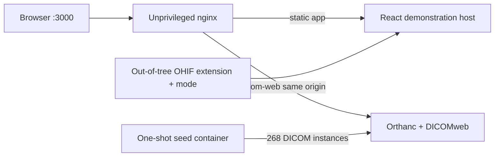

This is an OHIF 3.11 distribution delivered as an out-of-tree extension and mode; it adds a multi-study radiology workflow, captured Hanging Protocols, Montage viewports, smart loading, safe navigation, and key-image printing without forking OHIF.

# Medical DICOM Viewer Web

The original was built for a client and lives in a private repository. This is an independent reimplementation, written from scratch with synthetic data.

Instead of vendoring the large OHIF monorepo, this repository keeps the authored work in two packages under `extensions/` and `modes/`. A small React host renders the extension layout directly so the custom workflow can be reviewed and started with one command. The Docker demo also runs an Orthanc archive and exposes its DICOMweb API through the viewer origin.

This is a portfolio demonstration, not a medical device. It must not be used for diagnosis or with real patient data.

## What this repository adds

| Custom module | Purpose |
| --- | --- |
| Multi-study worklist and tabs | Filters a realistic worklist, expands series details, deduplicates open studies, and keeps several reads available as tabs. |
| Capturable Hanging Protocols | Saves the current grid, Montage layout, image, VOI, colormap, and relative framing for an exact exam description or a modality. Preferences stay in the browser. |
| Montage viewport | Displays the stack in selectable 1x1 through 4x4 subgrids and pages without creating an empty final page. |
| `SmartImageLoadManager` | Gives interaction requests priority over thumbnails and prefetches, preempts background work, and cancels requests that became stale. |
| Safe Stack Scroll | Serializes rapid navigation, clamps stack boundaries, and renders an image only after its load has completed. |
| Drag-only Reference Cursors | Shows the cursor on hover but synchronizes the slice only while the primary pointer button is down. |
| Relative framing | Captures pan and zoom independently of viewport pixel dimensions so a protocol can be restored in a different layout. |
| Key images and print board | Saves selected SOP instances with annotation snapshots, updates an existing key image instead of duplicating it, and builds a printable React/CSS board. |

The custom code is concentrated in [`extensions/radiology-workflow`](extensions/radiology-workflow) and registered by [`modes/radiology-workflow`](modes/radiology-workflow). The extension exposes an OHIF layout template, a Montage viewport, a toolbar item, a Hanging Protocol module, and reusable navigation/loading utilities.

### Clear ownership boundary

MPR, 3D, standard measurements, and segmentation are OHIF capabilities; they are not authored or reimplemented here. The standalone demonstration host shows the custom workflow around those capabilities and uses a small synthetic image renderer in place of OHIF's clinical Cornerstone viewport.

The source product also included mammography and tomosynthesis matching. It is deliberately omitted because a faithful demonstration needs a separate synthetic MG and digital breast tomosynthesis dataset, not CT/MR phantoms. PACS analytics belongs to a separate monitoring project. A proprietary report designer is not carried over; key-image printing is rebuilt with React and print CSS.

## The reproduced reading flow

The screen structure and decisions follow the original workflow rather than reducing it to a two-file sample:

1. Start on a worklist shaped like a real reading queue: 18 CT/MR studies, date presets, patient, identifier, accession, description, and modality filters.
2. Expand a row to inspect its series, then open the study. Open two more studies and switch, close, or reopen them from the tab strip.
3. Read with the series browser on the left, image area in the center, and measurements panel on the right.
4. Change the viewport grid or select a paged Montage subgrid. Scroll is bounded and foreground image work has priority over prefetching.
5. Capture the arrangement as a Hanging Protocol, scoped either to that exam description or to all studies of the modality. Apply the complete presentation or only its grid later.
6. Mark slices as key images, add a length annotation, and compose the selected images in the print board.

The demo intentionally uses one synthetic series per study. That keeps the data small while preserving the worklist, tab, layout, preference, and review interactions being demonstrated.

## Run the complete demo

Requirements: Git, Docker Desktop, and Docker Compose v2. Both `amd64` and `arm64` images are used; no account, key, or external service is required.

```bash
git clone https://github.com/riccardosapuppo/medical-dicom-viewer-web.git
cd medical-dicom-viewer-web
docker compose up --build
```

Open [http://localhost:3000](http://localhost:3000). The first start downloads the pinned container images, creates the viewer, starts Orthanc, imports 268 synthetic DICOM instances, and then starts the web application. The worklist status changes to `Orthanc connected · 18 studies` when the same-origin QIDO-RS query succeeds.

Stop with `Ctrl+C`; remove the stopped containers and network with:

```bash
docker compose down
```

The named Orthanc volume is retained. Use `docker compose down --volumes` only when you intentionally want to discard the local synthetic archive.

## Architecture



Orthanc is not published on a host port. Nginx is the only public container endpoint and proxies `/dicom-web/` internally, avoiding a permissive browser CORS setup. Authentication is disabled inside this isolated demo network because all records are synthetic; a deployed system needs TLS, authenticated DICOMweb, authorization, audit logging, and a hardened gateway.

The archive connection is observable, but the standalone host deliberately reads its display catalogue locally and renders procedural phantom images. In an upstream OHIF application, Cornerstone and the configured data source remain responsible for WADO-RS retrieval and clinical rendering; this package supplies the surrounding custom workflow.

## Use the packages with OHIF

The packages target OHIF `3.11.x` and leave the upstream source untouched:

- workspace-link or copy `extensions/radiology-workflow` into an OHIF application;
- workspace-link or copy `modes/radiology-workflow` alongside the application's modes;
- register `@portfolio/ohif-extension-radiology-workflow` and `@portfolio/ohif-mode-radiology-workflow` in the application's extension and mode configuration;
- keep the default and Cornerstone extensions enabled, as declared by the mode dependencies.

OHIF's [extension documentation](https://docs.ohif.org/3.11/platform/extensions/) describes the host application's registration mechanism. This repository does not pin a fork or replace upstream packages.

## Synthetic DICOM and privacy gate

All names, identifiers, accessions, images, and dates are invented. `npm run generate:dicom` deterministically rebuilds 18 studies and 268 uncompressed CT/MR instances from [`data/study-definitions.json`](data/study-definitions.json). Study, series, SOP, and implementation UIDs use the UUID-derived DICOM `2.25` root.

The DICOM test parses every generated file and rejects any tag outside the explicit allowlist in [`src/data/dicomTagAllowlist.ts`](src/data/dicomTagAllowlist.ts). This makes additions to the dataset reviewable instead of trusting filenames or display metadata.

## Fast verification without Docker

The test suite has no Docker, database, network, or Orthanc dependency:

```bash
npm ci
npm run build
npm test
```

It covers worklist filtering, tab isolation, Montage paging, protocol matching and capture, relative framing, load priority/preemption, safe scrolling, drag-only cursor synchronization, key-image identity, DICOMweb parsing, repository persistence, application registration, and the DICOM tag allowlist. GitHub Actions runs the same build and test commands on Node 20 without service containers.

For UI-only development, run `npm run dev`. If Orthanc is not listening on port `8042`, the worklist remains usable and explicitly reports `Local catalog`.

## Real limits

- The React host is an executable review surface for the custom extension, not a vendored OHIF/Cornerstone build. Stock MPR, 3D, standard measurements, and segmentation are therefore outside this repository.
- The procedural CT/MR phantoms are intentionally small and structurally valid, but they do not model diagnostic anatomy or every DICOM transfer syntax.
- Mammography/tomosynthesis matching from the source product is excluded until a suitable synthetic MG/DBT dataset exists.
- Hanging Protocols and key images are local browser preferences. There is no account sync, multi-user persistence, report signing, or clinical audit trail.
- The demo has no authentication and must stay local. It is not a production PACS, diagnostic viewer, or regulatory submission.
- Print output is a reconstructed React/CSS key-image sheet, not the proprietary reporting library used by the source product.

## License and upstream work

Original code in this repository is MIT licensed. OHIF is MIT licensed and is referenced as the target platform, not vendored or forked. Orthanc and the DICOMweb plugin run as a separate pinned container under their own licenses. See [`THIRD_PARTY_NOTICES.md`](THIRD_PARTY_NOTICES.md) for attribution and source links.
