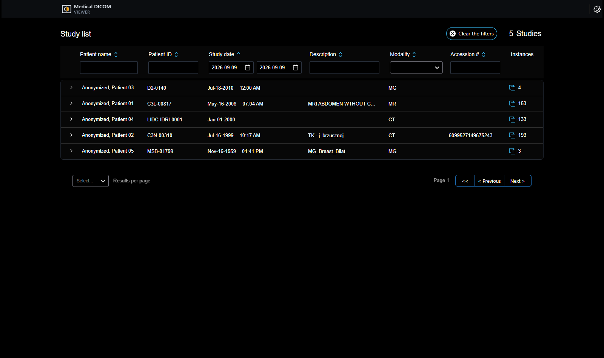

# Medical DICOM Viewer (Web)

A diagnostic DICOM viewer with the tools a reading room needs and an
open-source viewer does not ship: a subgrid that turns one viewport into a light
box, hanging protocols a radiologist saves and gets back on the next study of
the same kind, a reading list, prior studies alongside the current one, and two
Cornerstone tools wired up here because upstream leaves them out — including
patches to the drawing library itself.

It opens whatever DICOM an archive holds. Nothing in it decides by modality:
ultrasound, radiography, mammography and the rest open like anything else. The
studies below happen to be CT and MR because that is what was loaded to
demonstrate it, not because those are what it reads.

It is a fork of the [OHIF Viewer](https://github.com/OHIF/Viewers) at
3.10.0-beta.129, and it says so on purpose. OHIF is MIT licensed and both
copyright notices travel with this copy, in [LICENSE](LICENSE). What comes from
upstream and what was written here is set out below, in full: a fork that does
not draw that line is asking to be misread.



## What this adds to the viewer

**A subgrid inside a viewport.** One viewport divides into rows and columns of
cells, each showing a different image of the same series, all sharing the pixel
cache and the tool group so window level, zoom and pan stay in step across them.
The cells live in a rendering engine of their own, so enabling and resizing them
never reconfigures the shared offscreen buffer and never makes the other
viewports flicker. It is a light box for reading a long series without
scrolling through it a slice at a time.

**Hanging protocols, saved by the reader.** The current arrangement — grid,
which series sits where, the window each viewport is set to — is captured and
stored against the kind of study it was taken from, then offered again on the
next study of the same protocol. Saving keeps a local copy always and
synchronises to the archive when one is reachable, so a saved arrangement
survives a session with no backend.

**A reading list.** Images marked while going through a study, kept for writing
the report, with the star on the frame itself so a sheet shows at a glance what
was marked.

**Prior studies.** A second tab for the same patient's earlier imaging, opened
beside the current study or in a window of its own.

**Two Cornerstone tools the viewer does not register**: reference cursors, which
put the pointer's position in one viewport onto every other viewport of the same
anatomy, and a scale overlay. Both ship with the drawing library and neither is
wired up upstream, so a stock toolbar cannot offer them.

**Reference lines confined to one study**, and changes to the trackball, patched
into the drawing library rather than worked around above it.


**A guided tour of all of the above**, in the language of the interface, shown
once on the first study opened.

## Underneath

Most of the work is not in the feature list. Making a viewer built to sit
inside another application run on its own meant finding, and fixing, every
place it assumed a host page was there to answer for it.

**Patched drawing tools.** Reference lines that stayed confined to one study,
and changes to the trackball, are patched into Cornerstone itself rather than
worked around above it — linked in place of the published packages, so the fix
is where the behaviour is.

**It degrades instead of breaking.** Without a graphics context the images are
drawn on the processor and the viewer says so, in its own words; reformatting
is off and explains why rather than failing when pressed. With no archive
running, the notice names the archive it could not reach and how to start one.
A saved arrangement is kept locally when there is no backend to synchronise to.

**Three checks that drive a real browser**, in [scripts/](scripts/), because
nearly everything that went wrong here answered "yes" to whether it works:
`smoke` opens a study, `layout` reports text drawn over text and controls off
screen at two window sizes, and `controls` presses every control this fork adds
and reports what raises, what changes and what does nothing at all.

## Running it

The viewer reads from an archive over DICOMweb. The demonstration ships one, and
real studies to put in it.

```
docker compose up -d          # the archive
npm run data                  # fetch the studies, about 220 MB
npm run data:load             # load them into the archive
yarn install                  # once
yarn dev                      # the viewer, on http://localhost:3000
```

## The studies

Three real, de-identified clinical studies from
[The Cancer Imaging Archive](https://www.cancerimagingarchive.net/). They are a
sample chosen to exercise the viewer, not the range of what it opens: a chest CT,
a three-phase abdominal CT, and a five-sequence renal MR. Nothing is committed
here — a script fetches them, and keeps the licence file the archive ships beside
the images.

| Collection | Licence | DOI |
| --- | --- | --- |
| LIDC-IDRI | CC BY 3.0 | `10.7937/K9/TCIA.2015.LO9QL9SX` |
| CPTAC-CCRCC | CC BY 4.0 | `10.7937/k9/tcia.2018.oblamn27` |

The licence a collection is distributed under is taken from the file inside the
download rather than from the web page, which lists several because it covers
several kinds of data.

## What this is not

**Not a medical device, and not for diagnosis.** It reads published research
images and has been through none of the validation that clinical software
requires.

**Reformatting needs a graphics context.** Where the browser provides no WebGL
the viewer draws on the processor: studies open and the tools work, scrolling a
long series is slower, and the reformat button is off and says why.

**No user accounts and no server.** In a real installation the viewer sits behind
one that holds per-user settings and shared hanging protocols. Here those live in
the browser, which means they are per-machine and disappear with the site data.

**The reporting feature is not here.** Its designer came from a commercial
reporting library that is not mine to redistribute, and ran inside a page only
the production install served. Both are out of this repository rather than
present and switched off.

**Neither is the analytics dashboard**, which answered a question about a
department's workload rather than about reading images, and read it from an
endpoint that is not here either.

**The interface is in Italian**, as it was written, and so are the comments in
the parts I wrote — changing them would make this repository disagree with the
copy that runs. The commit history is in English.

## Layout

```
platform/          the viewer: application, core, both UI packages, i18n
extensions/        image display, measurement, segmentation — and the additions above
modes/             which tools and panels a kind of study opens with
@cornerstonejs/    two patched drawing tools, linked in place of the published ones
data/              which studies to fetch, and their attribution
scripts/           fetching the studies, loading the archive, the smoke check
docs/              screenshots, produced by the smoke check rather than by hand
```
