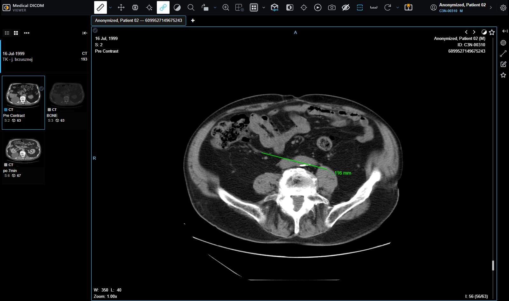

# Medical DICOM Viewer (Web)

A diagnostic DICOM viewer with the tools a reading room needs and an
open-source viewer does not ship: a subgrid that turns one viewport into a light
box, hanging protocols a radiologist saves and gets back on the next study of
the same kind, a reading list, prior studies alongside the current one, and two
Cornerstone tools wired up here because upstream leaves them out, plus patches
to the drawing library itself.

It opens whatever DICOM an archive holds. Nothing in it decides by modality:
ultrasound, radiography, mammography and the rest open like anything else. The
studies below happen to be CT and MR because that is what was loaded to
demonstrate it, not because those are what it reads.

It is a fork of the [OHIF Viewer](https://github.com/OHIF/Viewers) at
3.10.0-beta.129, and it says so on purpose. OHIF is MIT licensed and both
copyright notices travel with this copy, in [LICENSE](LICENSE). What comes from
upstream and what was written here is set out below, in full: a fork that does
not draw that line is asking to be misread.


A study open, with a length measured on it:



## What this adds to the viewer

**A subgrid inside a viewport.** One viewport divides into rows and columns of
cells, each showing a different image of the same series, all sharing the pixel
cache and the tool group so window level, zoom and pan stay in step across them.
The cells live in a rendering engine of their own, so enabling and resizing them
never reconfigures the shared offscreen buffer and never makes the other
viewports flicker. It is a light box for reading a long series without
scrolling through it a slice at a time.

**Hanging protocols, saved by the reader.** The current arrangement — grid,
which series sits where, the window each viewport is set to — is captured and
stored against the kind of study it was taken from, then offered again on the
next study of the same protocol. Saving keeps a local copy always and
synchronises to the archive when one is reachable, so a saved arrangement
survives a session with no backend.

**A reading list.** Images marked while going through a study, kept for writing
the report, with the star on the frame itself so a sheet shows at a glance what
was marked.

**Prior studies.** A second tab for the same patient's earlier imaging, opened
beside the current study or in a window of its own.

**Two Cornerstone tools the viewer does not register**: reference cursors, which
put the pointer's position in one viewport onto every other viewport of the same
anatomy, and a scale overlay. Both ship with the drawing library and neither is
wired up upstream, so a stock toolbar cannot offer them.

**Reference lines confined to one study**, and changes to the trackball, patched
into the drawing library rather than worked around above it.


**A guided tour of all of the above**, in the language of the interface, shown
once on the first study opened.

## Underneath

Most of the work is not in the feature list. Making a viewer built to sit
inside another application run on its own meant finding, and fixing, every
place it assumed a host page was there to answer for it.

**Patched drawing tools.** Reference lines that stayed confined to one study,
and changes to the trackball, are patched into Cornerstone itself and linked in
place of the published packages, so the fix is where the behaviour is, not
worked around above it.

**It degrades instead of breaking.** Without a graphics context the images are
drawn on the processor and the viewer says so, in its own words; reformatting
is off and explains why rather than failing when pressed. With no archive
running, the notice names the archive it could not reach and how to start one.
A saved arrangement is kept locally when there is no backend to synchronise to.

**Three checks that drive a real browser**, because nearly everything that went
wrong here answered "yes" to whether it works:

```
yarn check:smoke           # opens a study, draws a measurement, leaves the screenshots
yarn check:layout          # text drawn over text, controls off screen, at two window sizes
yarn check:controls        # presses every control this fork adds, one at a time
```

`yarn`, not `npm`: this page says below that installing with npm produces a
tree that does not build, and then named its own checks as `npm run` — as did
two of the scripts themselves, in the line each prints when it finishes. Both
reach the same scripts, but a README that contradicts itself is one somebody
follows in the wrong half.

None of the three starts anything. They attach to what **Running it** below
leaves running — the archive up, the studies loaded into it, and the viewer
serving on port 3000 — and they drive the browser already on the machine:
Edge, then Chrome, then a Chromium in Playwright's download cache if there is
one. `--channel <name>` names a different one. Each check prints which it got,
because a check whose output does not name what it drove is one whose green
nobody else can reproduce.

They drive it through `playwright-core`, which arrives with `@playwright/test`
in `yarn install` and deliberately ships no browsers of its own — that is what
the `-core` means, and why it costs two megabytes instead of four hundred. This
page used to ask for a hundred and fifty megabyte Chromium on top of it, because
the checks looked only in that download cache and, finding nothing, failed on a
machine with two browsers on it. Given the same three switches that turn on
software WebGL, Edge reports

```
WebGL 2.0 (OpenGL ES 3.0 Chromium)
ANGLE (Google, Vulkan 1.3.0 (SwiftShader Device), SwiftShader driver)
```

which is exactly what the downloaded Chromium reports. The download bought
nothing.

Run a check with nothing to drive, or with no archive behind the viewer, and it
stops in about a second naming the piece that is missing and the command that
supplies it, rather than spending ninety seconds on a navigation that was never
going to arrive. It leaves with status 2 rather than 1, because a check that
could not run is neither a pass nor a failure. `VIEWER_URL` points them
somewhere other than `http://localhost:3000`.

They also refuse to run against a source that has moved under them. Each control
carries the string its selector rests on, and that string is looked for in the
source before a browser is started. This was not a precaution: three of the six
controls were being pressed by names that had been renamed away — `Sottogriglia`
for `Subgrid`, `gestioneHP` for `hangingProtocols`, `preferiti.png` for
`favourites.png` — and so was the button that closes the guided tour, in all
three checks, which meant every one of them had been measuring the page through
the tour's veil. None of it showed as a broken check. It showed as dead buttons
and a covered page, which is what a broken application looks like from here, and
it stayed that way because running these needs an archive and a viewer up. A
rename now goes red in the same commit that makes it, in a second, with nothing
running.

`check:smoke` is also where the pictures in this README come from, so they are
always the current build rather than something taken by hand months ago.

**One check that needs no browser at all**, because it reads the source:

```
yarn check:english         # every piece of interface text a reader sees
```

There is no Italian locale in this viewer, so Italian on screen was never a
translation that could be swapped: it was written into the source and `t()`
never touched it.

The check reads the source with the TypeScript parser, and it does that because
the version that used regular expressions reported everything clean while the
About dialog still said "Basato su" and the preferences dialog said "Voce 1".
Three blind spots, and not one of them was the vocabulary: it looked for JSX
text between a `>` and a `<` on the same line, so a sentence written on a line
of its own had neither beside it; it excluded braces, so "Voce {index + 1}" was
skipped; and letting the match span lines instead filled the result with
`Record<string, unknown>`. The parser is never unsure which of those three a
piece of source is.

It also checks itself before it checks anything else. Four sentinels in four
shapes are put through the reader, and if any of them stops coming back the
check refuses to give a verdict at all rather than reporting the all-clear that
a reader which has quietly stopped looking would also report.

The fields of a saved arrangement were named in Italian too, and those are not
interface text: they are keys in JSON already written, to localStorage and to a
backend that is not part of this repository. Renaming them in the code alone
would leave every stored arrangement in place and unreadable. The new names are
written, the old ones are still accepted on the way in, and

```
yarn check:saved           # an arrangement saved before the rename still reads
```

drives that with an entry written the old way. Removing the migration turns six
of its eight checks red, which is how it was confirmed rather than assumed.

**And one that reads the page template**, because the de-branding replaced the
icon set and left the references behind:

```
yarn check:assets          # every file the page asks the browser for exists
```

The template declared twenty-five icons and four of them were there. Every load
asked for `favicon.ico` and got a 404; the web manifest listed nine icons under
the base path of somebody else's deployment; two of the files it pointed at
pointed in turn at four more that had never existed; and the title an iPhone
would have put under the icon on its home screen was `@ohif/app`, the upstream
package name.

None of that fails anything. A missing icon is a browser shrugging, and the
only trace was one line in a console the smoke check prints without counting.
So this reads the templates and the manifests instead, needs neither a browser
nor an archive, and answers in the time a directory listing takes. The icon now
exists, built from the two sizes that were already there, and what does not
exist is no longer asked for.

**A VOI function that is declared but not applied.** A mammogram opened washed
out, with the air around the breast at 29% grey instead of black, and the
overlay reported a window of 589 that appears nowhere in the file, which
declares 256.
The file asks for a **sigmoid** VOI, and the renderer takes the sigmoid to work
out the range it will draw and then draws that range **linearly**. The number
589 is the span between the 1% and 99% points of a sigmoid curve, presented as
if it were a window width. Declaring only the VOI functions that are actually
applied puts it back to the 256 the file asks for: black background, full
contrast, and a readout that matches the data. Measured, not judged by eye, the
background went from 29% to 0%.

## Before you start

- **Node.js 20** or newer. The fork inherits `>=18` from upstream OHIF; 20 is
  what this is built and checked on.
- **Yarn 1.x** (Classic), not npm. OHIF is a Lerna monorepo with a `yarn.lock`,
  and installing it with npm produces a different tree that does not build.
  `npm install -g yarn` if you do not have it.
- **Docker**, with the Compose plugin. The archive is
  [Orthanc](https://www.orthanc-server.com/) in a container, with nothing to
  install and nothing left behind afterwards but one named volume.
- **113 MB down and 268 MB in `data/`**, once, for the studies (measured, not
  rounded). They are not committed here: a script fetches them from The Cancer
  Imaging Archive. The figure was 350 MB until the mammograms were added and
  nobody re-measured; it is the folder `du -sh data` reports.
- **1.3 GB of `node_modules`** on top of that, once, after `yarn install` on a
  Lerna monorepo with Cornerstone in it. Measured with `du -sh node_modules`,
  which is worth naming: a recursive size taken through the Windows API
  reported **1 MB** for the same folder, because it gives up on long paths and
  says so to nobody. The line above used to say "and two patched packages":
  `patch-package` is wired in, and there are no patches.
- **A build cache**, under `platform/app/node_modules/`: about 660 MB once the
  viewer has been compiled for development, and 1.6 GB more if a production
  build is ever run. Both live inside a `node_modules`, so deleting that folder
  takes them with it.

Nothing else. No database of your own, no DICOM toolkit, no account anywhere.

## Running it

The viewer reads from an archive over DICOMweb. The demonstration ships one, and
real studies to put in it.

```
git clone https://github.com/riccardosapuppo/medical-dicom-viewer-web
cd medical-dicom-viewer-web

yarn start
```

That is all of it: install, start the archive, fetch the studies, load them into
the archive, serve the viewer on http://localhost:3000. Each of the five steps
is skipped if it is already done, and what it asks is about the world rather
than a marker file — is something answering on the archive's port, are the
images on disk, does the archive hold them. So running it again after deleting
any one piece repairs that piece, running it twice costs a few HTTP requests,
and it never takes anything down.

The viewer is compiled from source, and the first compilation is the long part.
It takes about a minute and a half on the machine this was written on, and it
took a little over two -- measured by running the two configurations alternately
on the same machine, several times each, because a single before-and-after on a
laptop measures the laptop. The minute that went was not the price of a large
project:

- every one of the 1601 source files went through babel **twice**, because two
  rules matched the same files and webpack applies all the rules that match;
- babel had no target declared, so in development it rewrote every file down to
  ES5 -- for a browser you are not using, since the one that matters here is the
  one you have open;
- and every compilation built a service worker, which meant reading and
  fingerprinting 240 files totalling 116 MB, for a worker that
  `init-service-worker.js` then refuses to register because you are on
  localhost.

None of that is caching, and none of it helped the second run either. It is
gone; production builds are unchanged, and still target ES5 and still ship the
service worker, because there the browser is somebody else's.

The second start is a different question, and there caching is precisely the
answer. It writes to disc now, so closing the server no longer throws the build
away: the starts after the first take about **40%** of the time the first one
took, measured on two different days and two different machine loads, which
agreed on the ratio and not on the seconds.

That cache used to be in memory only, and deliberately -- a cache that writes
nothing can never serve anything stale. What settled it was measuring the
setting that did the protecting, `snapshot.managedPaths: []`, which tells
webpack to check all of `node_modules` like ordinary source: with it in place
webpack stores no cache at all, and the first compilation is twenty seconds
slower as well. It was never a trade between safety and speed. There was no
cache to trade.

What replaced it is narrower and aimed at the real case. Dependencies here are
modified through `patch-package`, and every file in `patches/` is now a build
dependency: change one and the cache is thrown away. For editing `node_modules`
by hand, with no patch file, `yarn dev:no:cache` was already there.

`yarn start` did not use to do that, which is the part worth admitting: it was
an alias for `yarn dev`, so the shortest-looking command in the file was the one
that skipped the other four and served a viewer with nothing behind it. An empty
study list is what that looks like from the browser.

The five steps, to run one at a time or when one of them fails:

```
yarn install                  # once, and it is a big install
docker compose up -d          # the archive
yarn data                     # fetch the studies: 113 MB down, 268 MB in data/
yarn data:load                # load them into the archive
yarn dev                      # the viewer, on http://localhost:3000
```

`yarn install` comes before `yarn data:load`, which is the order that works: the
load step reads each file with `dicom-parser` before sending it, so on a fresh
clone it cannot run until the modules are there. In the order this README gave
until now it came last, **the load died**, and nothing noticed, because
everybody who ran it already had `node_modules`.

`docker compose down -v` puts the machine back as it was, archive volume
included; `rm -rf node_modules data` takes the rest, `data/` holding both the
downloaded images and `studies.json`.

## The studies

Five real, de-identified clinical studies from
[The Cancer Imaging Archive](https://www.cancerimagingarchive.net/). They are a
sample chosen to exercise the viewer, not the range of what it opens, since
nothing in the viewer decides by modality. Nothing is committed here: a script
fetches them, and keeps the licence file the archive ships beside the images.

| Study | Collection | Series | Images |
| --- | --- | --- | --- |
| Chest CT, lung nodule screening | LIDC-IDRI | 1 | 133 |
| Abdominal CT, multiphase | CPTAC-CCRCC | 3 | 193 |
| Renal MR, five sequences | CPTAC-CCRCC | 5 | 153 |
| Screening mammogram, four views | CMMD | 1 | 4 |
| Bilateral mammogram, three named series | CMB-BRCA | 3 | 3 |

Five studies from four collections, because two come from CPTAC-CCRCC, and a
licence belongs to a collection rather than to a study:

| Collection | Licence | DOI |
| --- | --- | --- |
| LIDC-IDRI | CC BY 3.0 | `10.7937/K9/TCIA.2015.LO9QL9SX` |
| CPTAC-CCRCC | CC BY 4.0 | `10.7937/k9/tcia.2018.oblamn27` |
| CMMD | CC BY 4.0 | `10.7937/tcia.eqde-4b16` |
| CMB-BRCA | CC BY 4.0 | `10.7937/dx22-8j71` |

The two mammograms are here because they break assumptions the CT and MR
studies never test, and they break different ones. The CMMD study is eight bits
rather than sixteen, has no rescale to Hounsfield units, no slice geometry, no
pixel spacing, and declares a **sigmoid** VOI, which found a real defect,
below.
The CMB-BRCA study stores each view as its own series rather than as frames of
one, which is how most archives arrange a screening study and the layout a
viewer has to be right about.

The licence a collection is distributed under is taken from the file inside the
download rather than from the web page, which lists several because it covers
several kinds of data. The DOI is the one thing that cannot come from the
download: it is on the collection page, and it is cited above so the data can
be found again.

### Names, and what was left alone

The identifiers these collections publish (LIDC-IDRI-0001, C3N-00310,
MSB-01799) are what makes an image traceable back to the archive it came from,
and the attribution above refers to them. They are kept exactly as published.

What they are not is a name. In a worklist the name column is the first thing
read, and a column of catalogue numbers says the software failed to fill the
field in, not "a person whose identity was removed". So each patient is shown
as *Anonymized, Patient 01* and so on, substituted on the way into the archive
and never on disk: the downloaded files stay byte for byte what the collection
published.
## What this is not

**Not a medical device, and not for diagnosis.** It reads published research
images and has been through none of the validation that clinical software
requires.

**Reformatting needs a graphics context.** Where the browser provides no WebGL
the viewer draws on the processor: studies open and the tools work, scrolling a
long series is slower, and the reformat button is off and says why.

**No user accounts and no server.** In a real installation the viewer sits behind
one that holds per-user settings and shared hanging protocols. Here those live in
the browser, which means they are per-machine and disappear with the site data.

**The reporting feature is not here.** Its designer came from a commercial
reporting library that is not mine to redistribute, and ran inside a page only
the production install served. Both are out of this repository rather than
present and switched off.

**Neither is the analytics dashboard**, which answered a question about a
department's workload rather than about reading images, and read it from an
endpoint that is not here either.

**The interface is in Italian**, as it was written, and so are the comments in
the parts I wrote, because changing them would make this repository disagree
with the copy that runs. The commit history is in English.

## Layout

```
platform/          the viewer: application, core, both UI packages, i18n
extensions/        image display, measurement, segmentation — and the additions above
modes/             which tools and panels a kind of study opens with
@cornerstonejs/    two patched drawing tools, linked in place of the published ones
data/              which studies to fetch, and their attribution
scripts/           fetching the studies, loading the archive, the smoke check
docs/              screenshots, produced by the smoke check rather than by hand
```

## Production reconstruction

This repository is an independent reconstruction of a production system I
designed and developed.

Confidentiality and intellectual property constraints mean the original cannot
be published. The additions here were built again over a public checkout of the
same upstream viewer so they could be shown and run, preserving the core
architecture, workflows and technical challenges of the production solution,
with newly written code and fictional data.

No proprietary source code, confidential data or client assets from the
original system are included in this repository.

Only that second sentence differs from the notice every other repository in
this portfolio carries, and it differs because this one is a declared fork:
the additions were rebuilt over the same public upstream, not from nothing.
